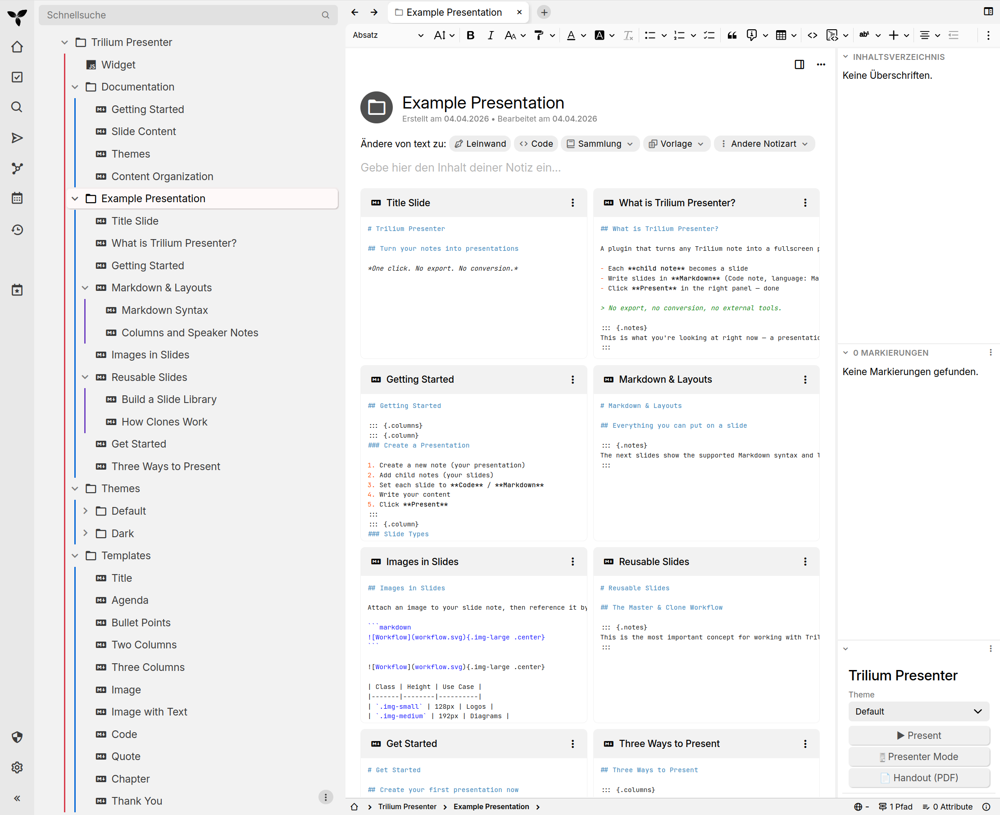
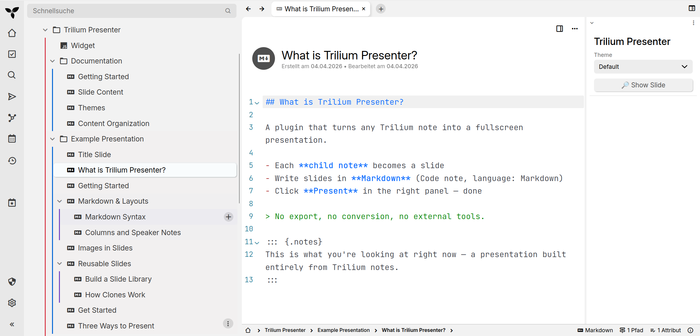
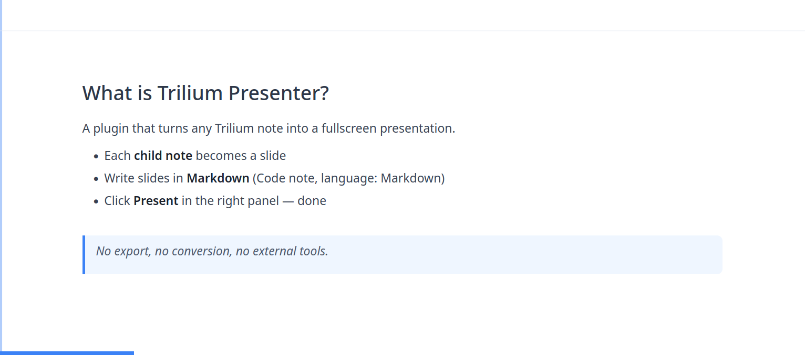
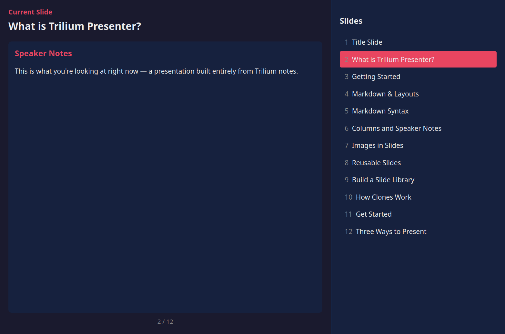

# Trilium Presenter Plugin

[](https://github.com/Stefan-Schmidbauer/trilium-presenter-plugin/releases/latest)
[](LICENSE)
[](https://github.com/TriliumNext/Notes)
[](mcp/README.md)

Turn any Trilium note into a fullscreen presentation -- directly from Trilium, with one click.



## Features

- **One-click presentations** from any note with children
- **Markdown slides** with Pandoc-compatible syntax (columns, speaker notes, code blocks)
- **Depth-first traversal** -- organize slides in sub-topics, they unfold automatically
- **Presenter mode** with speaker notes and slide list, synced via BroadcastChannel
- **Handout/PDF export** with one page per slide
- **Theme system** -- CSS + SVG backgrounds as Trilium notes, selectable per presentation
- **Slide templates** -- 11 ready-made layouts for quick slide creation
- **Keyboard & mouse navigation** with progress bar
- **Configurable language** via `#presenterLang` label
- **AI slide authoring** -- an [MCP server](#mcp-server-ai-slide-authoring) lets an AI assistant create & manage presentations directly in Trilium

## Installation

1. Download `trilium-presenter-plugin.zip` from the [latest release](../../releases/latest)
2. In Trilium, right-click any note in the tree and select **Import into note**
3. Select the downloaded `.zip` file
4. Trilium disables imported widgets by default -- open the **Widget** note inside the imported "Trilium Presenter" tree, find the `#disabled:widget` attribute and rename it to `#widget`
5. Reload Trilium (Ctrl+R) -- the **Trilium Presenter** widget appears in the right panel

## Quick Start

**Fastest way:** Navigate to the imported **Example Presentation** note and click **Present** -- it walks you through all features including Markdown syntax, columns, images, and the Master/Clone workflow.

**From scratch:**

1. Create a note and add child notes -- each child becomes a slide
2. Set child note type to **Code** with language **Markdown** (`text/x-markdown`)
3. Navigate to your presentation note and click **Present** in the right panel





## MCP Server (AI slide authoring)

Let an AI assistant build your decks. The [`mcp/`](mcp/) folder ships a Model Context Protocol server that creates and manages presentations directly in Trilium via the ETAPI -- ask Claude something like *"Create a 5-slide intro to our Q3 roadmap"* and the slides appear in your note tree, ready to present.

The slide format the AI follows is loaded live from the **Slide Content** documentation note (label `#presenterSlideFormat`) -- so the format reference in these docs is the single source of truth for both humans and the AI. See [mcp/README.md](mcp/README.md) for setup.

## Slide Organization

Slides are collected via **depth-first pre-order traversal**:

```
My Presentation
  Title Slide              -> Slide 1
  Introduction             -> Slide 2
  Deep Dive                -> Slide 3 (section break)
    Details A              -> Slide 4
    Details B              -> Slide 5
  Conclusion               -> Slide 6
```

Container notes (`text/html` type) are skipped but their children are included. This lets you use folders to organize slides without creating empty slides.

## Modes

| Button | Description |
|--------|-------------|
| **Present** | Fullscreen presentation in a new window |
| **Presenter Mode** | Speaker view with notes, slide list, and BroadcastChannel sync |
| **Handout (PDF)** | Print-optimized view, one page per slide, auto-opens print dialog |
| **Show Slide** | Preview a single Markdown slide with theme (visible on individual slide notes) |



## Themes

Select a theme from the dropdown before presenting. Themes are Trilium notes with the `#presenterTheme` label containing CSS sub-notes (Base, Title Slide, Content Slide) and optional SVG background attachments.

Included themes: **Default** (light) and **Dark**.

## Slide Types

The first slide defaults to `title` layout, others to `content`. Override with `#slideType` label:
- `#slideType=title` -- Title slide styling
- `#slideType=content` -- Content slide styling
- Custom types by adding matching CSS notes to your theme

## Configuration

| Label | Description | Default |
|-------|-------------|---------|
| `#presenterLang` | HTML lang attribute | `en` |
| `#slideType` | Slide layout type | auto |
| `#presenterTheme` | Mark a note as theme | -- |

## Documentation

See the [docs/](docs/) folder:
- [Getting Started](docs/getting-started.md)
- [Slide Content](docs/slide-content.md) -- full Markdown & Pandoc syntax reference
- [Slide Format](docs/slide-format.md) -- compact format reference (also drives the MCP server)
- [Themes](docs/themes.md) -- creating custom themes
- [Content Organization](docs/content-organization.md) -- clone-based slide library workflow
- [MCP Server](docs/mcp.md) -- AI slide authoring overview ([setup](mcp/README.md))
- [About](docs/about.md) -- author, license, and links

## Author

**Stefan Schmidbauer** -- [GitHub](https://github.com/Stefan-Schmidbauer)

Built with [Claude Code](https://claude.ai/claude-code) as co-author.

## License

MIT -- see [LICENSE](LICENSE)
