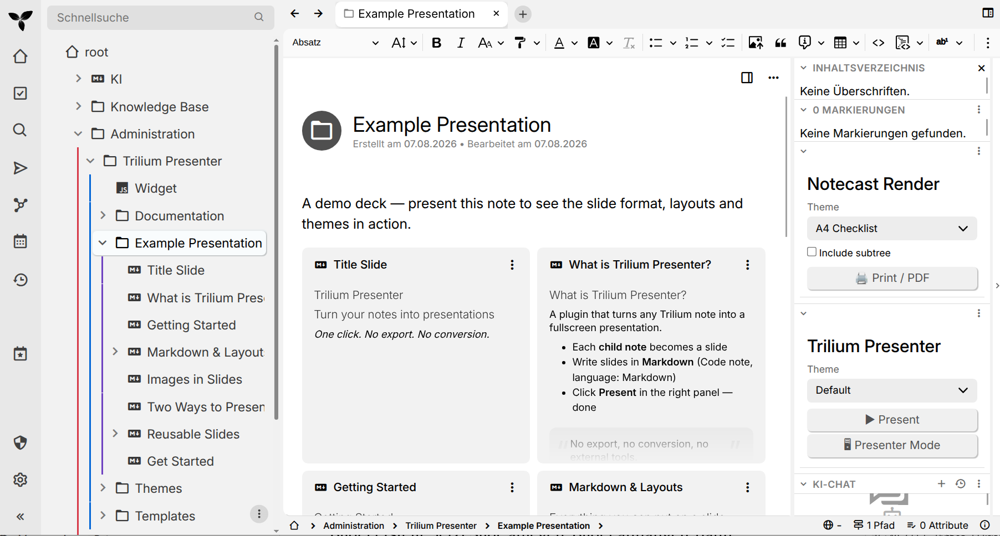
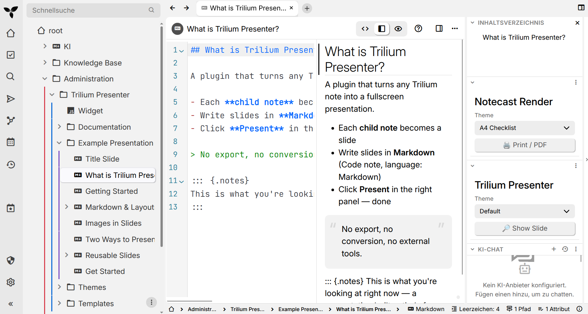
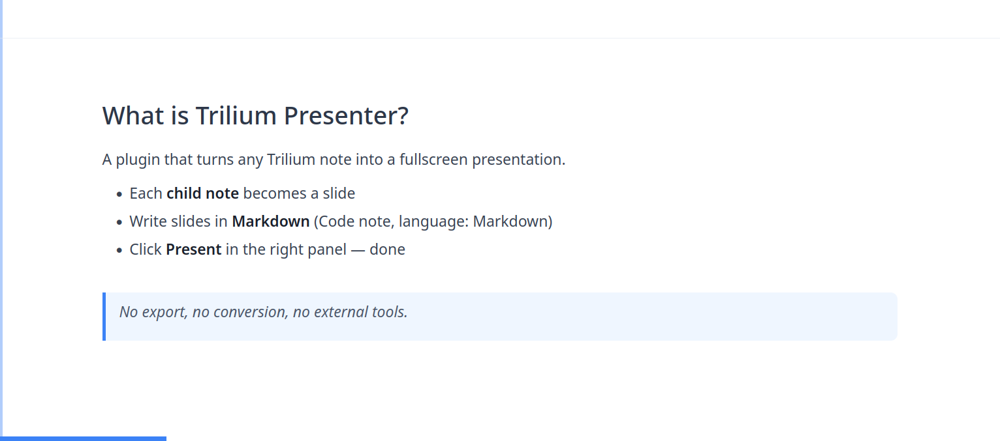
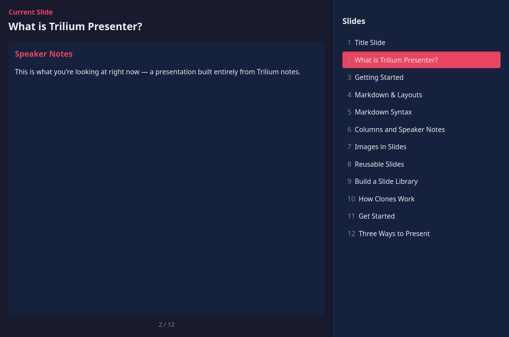

# Trilium Presenter Plugin

[](https://github.com/Stefan-Schmidbauer/trilium-presenter-plugin/releases/latest)
[](LICENSE)
[](https://triliumnotes.org)
[](https://github.com/Stefan-Schmidbauer/trilium-notecast-mcp)
[](https://github.com/Stefan-Schmidbauer/trilium-notecast-render)

Turn any Trilium note into a fullscreen presentation -- directly from Trilium, with one click.



## Features

- **One-click presentations** from any note with children
- **Markdown slides** with Pandoc-compatible syntax (columns, speaker notes, code blocks)
- **Depth-first traversal** -- organize slides in sub-topics, they unfold automatically
- **Presenter mode** with speaker notes and slide list, synced via BroadcastChannel
- **Theme system** -- CSS + SVG backgrounds as Trilium notes, selectable per presentation
- **Slide templates** -- 11 ready-made layouts for quick slide creation
- **Keyboard & mouse navigation** with progress bar
- **Configurable language** via `#presenterLang` label
- **AI slide authoring** -- an [MCP server](#mcp-server-ai-slide-authoring) lets an AI assistant create & manage presentations directly in Trilium

## Installation

1. Download `trilium-presenter-plugin.zip` from the [latest release](../../releases/latest)
2. In Trilium, right-click any note in the tree and select **Import into note**
3. Select the downloaded `.zip` file
4. Trilium disables imported widgets by default -- open the **Widget** note inside the imported "Trilium Presenter" tree, find the `#disabled:widget` attribute and rename it to `#widget`
5. Reload Trilium (Ctrl+R) -- the **Trilium Presenter** widget appears in the right panel

## Upgrading from 1.x

Version 2 removes the **Handout (PDF)** button. Printing moved to the sibling plugin [**trilium-notecast-render**](https://github.com/Stefan-Schmidbauer/trilium-notecast-render), which prints any Notecast type by one code path: install it alongside this one, open the presentation note, tick **Include subtree** and print. You get one page per slide in tree order -- in landscape, which the presenter's portrait handout never was.

Three things worth knowing before you upgrade:

- **`#slideIgnore` does not reach the renderer.** It is a presenter label, and the renderer deliberately reads none of ours. A "Handouts" or "Notes" folder you kept off screen with `#slideIgnore=subtree` **will appear in the printout**. If a branch has to stay out of both, park it outside the presentation note.
- **Themes installed before v2 may still carry a "Handout" note.** Delete it. Nothing reads it -- printing is the renderer's job -- and the widget no longer treats the title specially, so a leftover simply registers as a slide type called `handout` that nothing ever emits.
- **Presenting itself is unchanged.** Decks, themes, templates, presenter mode and every label except the handout path work exactly as before.

## Quick Start

**Fastest way:** Navigate to the imported **Example Presentation** note and click **Present** -- it walks you through all features including Markdown syntax, columns, images, and the Master/Clone workflow.

**From scratch:**

1. Create a note and add child notes -- each child becomes a slide
2. Set child note type to **Code** with language **Markdown** (`text/x-markdown`)
3. Navigate to your presentation note and click **Present** in the right panel





## MCP Server (AI slide authoring)

Let an AI assistant build your decks. A companion Model Context Protocol server, [**trilium-notecast-mcp**](https://github.com/Stefan-Schmidbauer/trilium-notecast-mcp), creates and manages notes directly in Trilium via the ETAPI -- ask Claude something like *"Create a 5-slide intro to our Q3 roadmap"* and the slides appear in your note tree, ready to present. It is installed separately from this plugin; the two meet inside Trilium.

The server is a generic authoring engine: it ships no formats of its own, but writes notes of whatever **type** your Trilium defines. This plugin supplies the `slide` type, so the server can author slides out of the box.

The slide format the AI follows is loaded live from the **Slide Format** documentation note (label `#notecastType=slide`) -- so that one note is the single source of truth for slide-creation rules, shared by both humans and the AI (it used to be hardcoded in the server). See the [server's README](https://github.com/Stefan-Schmidbauer/trilium-notecast-mcp#readme) for setup.

## The Notecast family

This plugin is the **presentation** specialist of three repositories that read and write the same Trilium notes, each doing one job:

| Repo | Role |
|---|---|
| **`trilium-presenter-plugin`** (this repo) | **presents a subtree on screen** |
| [`trilium-notecast-mcp`](https://github.com/Stefan-Schmidbauer/trilium-notecast-mcp) | authors typed notes (`#notecastType`) via the ETAPI |
| [`trilium-notecast-render`](https://github.com/Stefan-Schmidbauer/trilium-notecast-render) | renders a note to print/PDF in a chosen theme |

They are coupled only through Trilium, by a handful of labels. That coupling is the shared [label contract](https://github.com/Stefan-Schmidbauer/trilium-notecast-mcp/blob/main/docs/notecast-contract.md), which lives in the MCP repo and is binding on all three -- including the labels this plugin owns, `#notecastType=slide` and `#presenterTheme`.

Each is installed separately: this plugin and the renderer as Trilium note imports, the MCP server alongside your AI assistant. **Printing a deck as a handout is the renderer's job** -- this plugin presents, it does not print.

## Slide Organization

Slides are collected via **depth-first pre-order traversal**:

```
My Presentation
  Title Slide              -> Slide 1
  Introduction             -> Slide 2
  Deep Dive                -> Slide 3 (section break)
    Details A              -> Slide 4
    Details B              -> Slide 5
  Conclusion               -> Slide 6
```

Container notes (`text/html` type) are skipped but their children are included. This lets you use folders to organize slides without creating empty slides.

## Modes

| Button | Description |
|--------|-------------|
| **Present** | Fullscreen presentation in a new window |
| **Presenter Mode** | Speaker view with notes, slide list, and BroadcastChannel sync |
| **Show Slide** | Preview a single Markdown slide with theme (visible on individual slide notes) |



## Themes

Select a theme from the dropdown before presenting. Themes are Trilium notes with the `#presenterTheme` label containing CSS sub-notes (Base, Title Slide, Content Slide) and optional SVG background attachments.

Included themes: **Default** (light) and **Dark**.

## Slide Types

The first slide defaults to `title` layout, others to `content`. Override with `#slideType` label:
- `#slideType=title` -- Title slide styling
- `#slideType=content` -- Content slide styling
- Custom types by adding matching CSS notes to your theme

## Configuration

| Label | Description | Default |
|-------|-------------|---------|
| `#presenterLang` | HTML lang attribute | `en` |
| `#slideType` | Slide layout type | auto |
| `#presenterTheme` | Mark a note as theme | -- |
| `#slideIgnore` | Skip this note (children still become slides) | -- |
| `#slideIgnore=subtree` | Skip this note and its whole branch | -- |

Notes whose content is empty or whitespace only are skipped automatically, so
pure grouping notes need no label at all.

## Development

```bash
pip install -r requirements-dev.txt   # pinned; the widget tests need nothing
ruff check .                # lint, same versions CI uses
pytest                      # the import zip matches the note tree it declares
node --test                 # the widget's escaping and rendering helpers
python3 build-zip.py        # build the archive locally
```

Both suites run in CI on every push. Neither needs a Trilium instance:

- **`tests/test_build_zip.py`** builds the real archive and checks it against its
  own manifest — every declared file present, every declared label emitted. That
  second check exists because the opposite once shipped: while `meta.json` was
  exported from a live Trilium and the files copied beside it, the two drifted
  for months.
- **`tests/widget.test.js`** loads `src/widget.js` in node behind a two-method
  Trilium stub (`tests/stub-trilium.js`) and exercises the helpers that build the
  generated document. The window that document opens in is same-origin with
  Trilium, so the escaping there is a security boundary, not cosmetics.

This does **not** replace the repo rule that widget code is verified by running
it in Trilium — the tests cover the string-producing helpers, not the UI.

## Documentation

See the [docs/](docs/) folder:
- [Getting Started](docs/getting-started.md)
- [Slide Content](docs/slide-content.md) -- full Markdown & Pandoc syntax reference
- [Slide Format](docs/slide-format.md) -- compact format reference (also drives the MCP server)
- [Themes](docs/themes.md) -- creating custom themes
- [Content Organization](docs/content-organization.md) -- clone-based slide library workflow
- [MCP Server](docs/mcp.md) -- AI slide authoring overview ([setup](https://github.com/Stefan-Schmidbauer/trilium-notecast-mcp#readme))
- [About](docs/about.md) -- author, license, and links

## Author

**Stefan Schmidbauer** -- [GitHub](https://github.com/Stefan-Schmidbauer)

Built with [Claude Code](https://claude.ai/claude-code) as co-author.

## License

MIT -- see [LICENSE](LICENSE)
